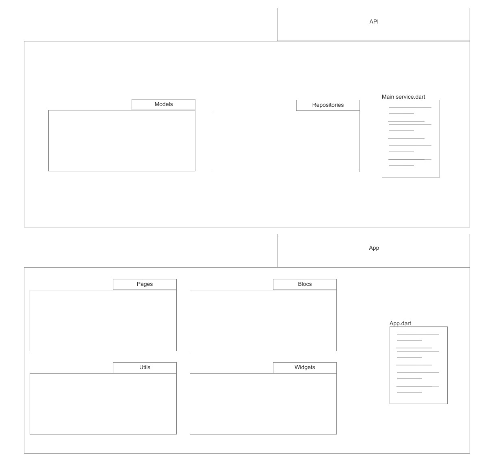
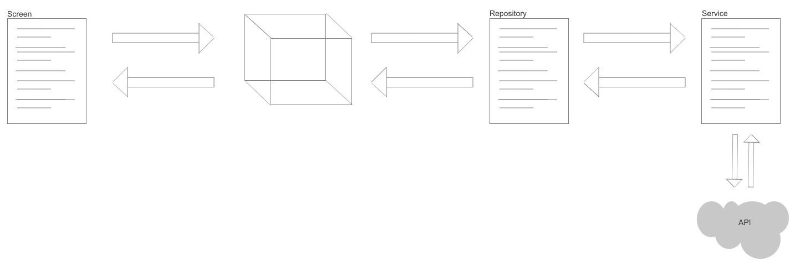
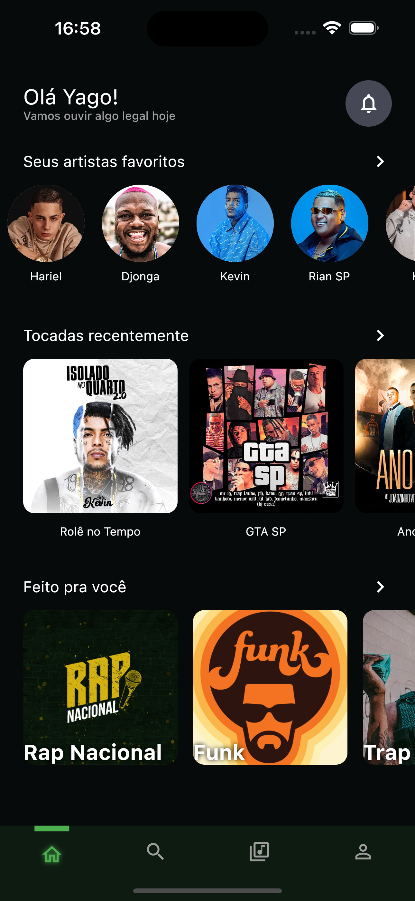
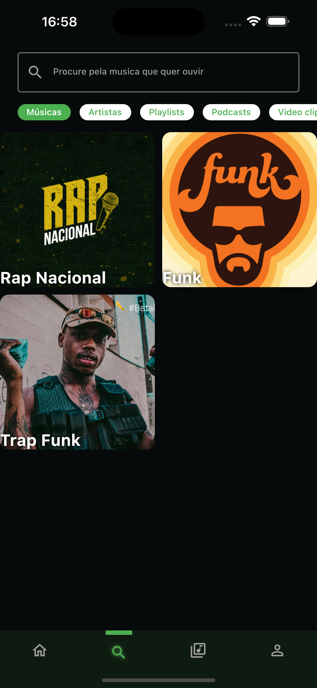
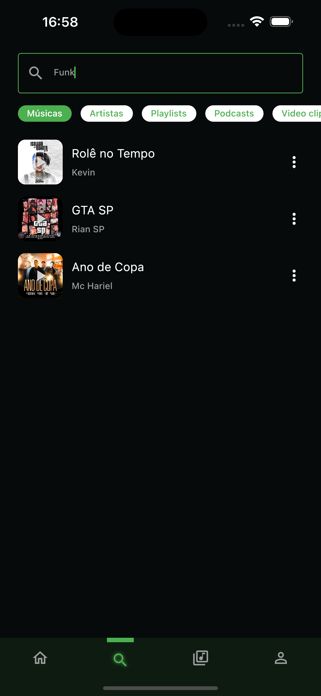
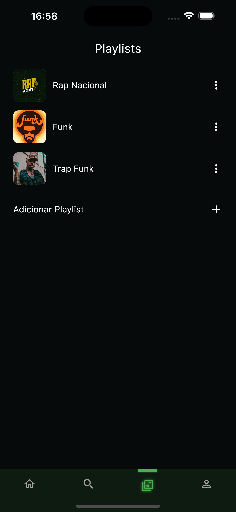
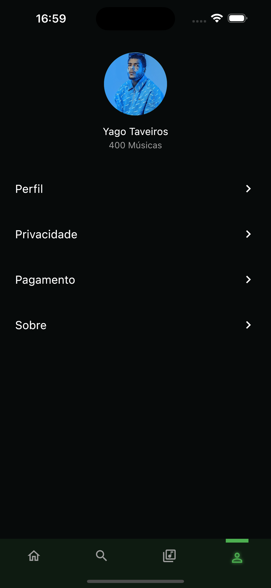

# music_app

Aplicativo de música baseado em um design do [Dribbble](https://dribbble.com/shots/17409554-Spotify-App-Redesign-Concept) 

## Sobre

Esse projeto foi feito em Flutter e esta atalmente na versão 0.1

Alguma telas como Home, Busca, Playlists e perfil já foram implementadas com os dados mocados

### Sobre o desenvolvimento

Foi utilizado uma arquitetura baseada em camadas, onde temos dois diretórios principais, App e Api, onde a camada Api é responsável por gerir os dados da aplicação, parsers, cache, comunicação com a API Rest, models e service.

A nível de funcionalidade, nossas telas se adicionam eventos aos blocs, os blocs acessavam os repositories, que por sua vez comunicavam com os services ou com o cache e retornam para o bloc que emit um novo estado para a tela, como mostrado na imagem a baixo

## Telas

## próximos passos

Os próximos passos são, implementar a API Rest com NestJs, para salvar playlists, artistas favoritos, músicas, for you e configurações de perfil.

## Sujestões

Em casos de sujestões, abra uma issue ou entre em contato pelo Email (ytaveiros@gmail.com)
